

 

  

---

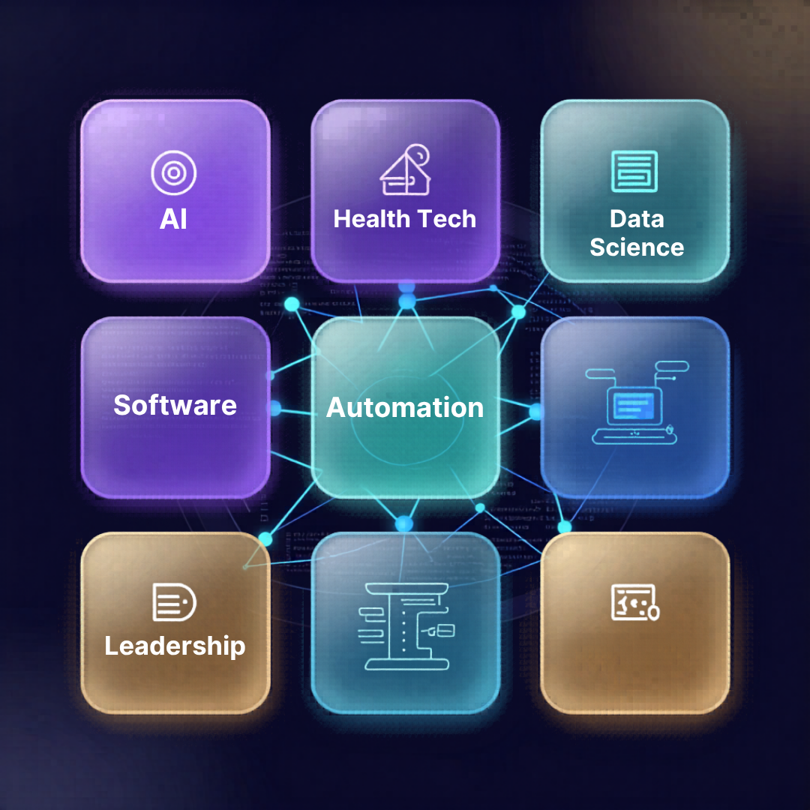

## Hey Mate, I’m Yehan... ✨

I am a **BSc (Hons) Computer Science undergraduate** at **NSBM Green University**, affiliated with the **University of Plymouth**.

My strongest direction sits at the intersection of **artificial intelligence, machine learning, medical AI, dermatology technology, computer vision, explainable AI, data science, software development, workflow automation, and human centred digital systems**.

I enjoy building work that is technically grounded, clearly documented, and meaningful beyond the code. My current focus is shaped by responsible AI, health technology, applied machine learning, intelligent systems, and digital products that help people make better decisions with clarity and confidence.

 

### AI and health tech first. Software and data second. Automation and systems third. Leadership as the amplifier. Creativity as the personality.

 

---

## Current Focus

<table>
<tr>
<td width="50%">

### AI and Health Tech

• Explainable AI for skin lesion decision support  
• Medical image classification  
• Computer vision and responsible AI  
• Model evaluation and transparent outputs  
• Human oversight in AI supported decisions  

</td>
<td width="50%">

### Portfolio and Professional Growth

• GitHub and LinkedIn project documentation  
• AI, data, software, and automation case studies  
• Stronger public technical presence  
• Clean project storytelling and visual proof  
• Professional identity around health technology and applied AI  

</td>
</tr>
</table>

---

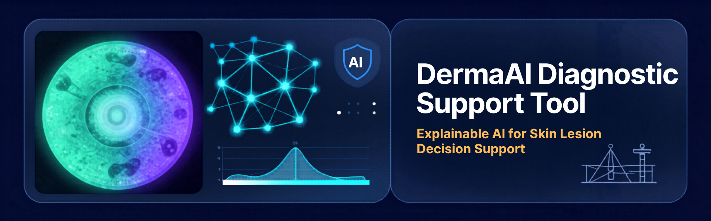

 

# Flagship Project

## DermaAI Diagnostic Support Tool

### An Explainable AI Based Diagnostic Assistance Tool for Skin Lesions

DermaAI is my **independent final year research project** for **PUSL3190 Computing Project**. It is an **academic decision support prototype** designed to explore how explainable AI can support skin lesion classification through image based machine learning and visual explanation methods.

The system uses a fine tuned **MobileNetV2** model trained with the **HAM10000 dataset**. It allows users to upload dermoscopic skin lesion images, receive a predicted lesion class, view confidence based messaging, inspect probability distribution, and understand model attention through **Grad CAM** visual explanations. **SHAP evidence exploration** was also considered as part of the explainability direction.

This project is framed as an academic prototype for responsible AI and decision support. It is **not a clinically validated diagnostic product** and does **not replace professional medical judgement**.

 

<table>
<tr>
<td width="33%">

### Core Area

Medical AI  
Dermatology technology  
Computer vision  
Explainable AI  
Responsible AI  
Health technology  

</td>
<td width="33%">

### Technologies

Python  
TensorFlow  
Keras  
MobileNetV2  
Flask  
Grad CAM  
SHAP exploration  

</td>
<td width="33%">

### Outputs

Image upload  
Predicted lesion class  
Confidence messaging  
Probability distribution  
Visual explanation  
Medical disclaimer  

</td>
</tr>
</table>

 

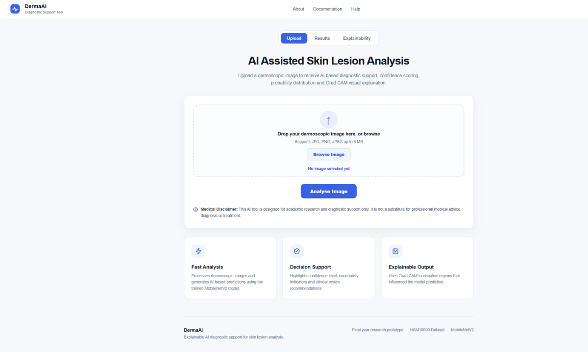
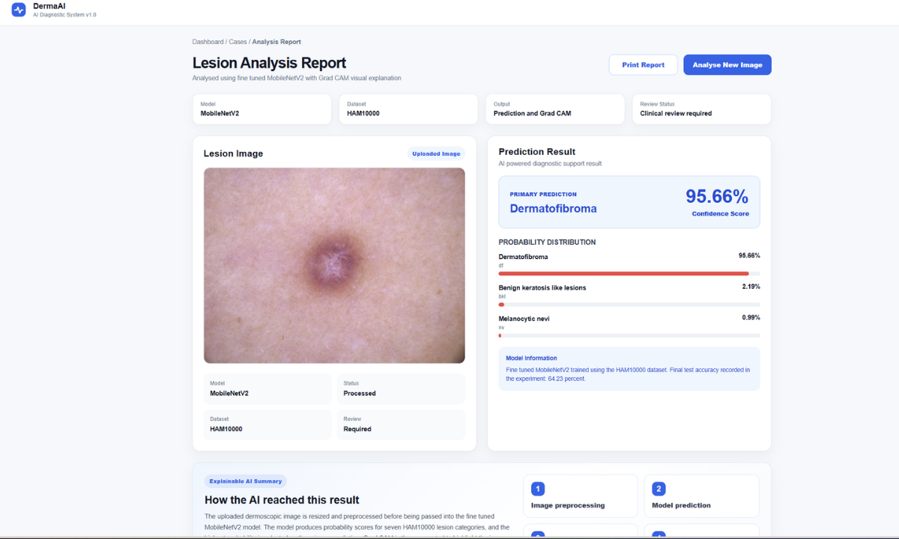
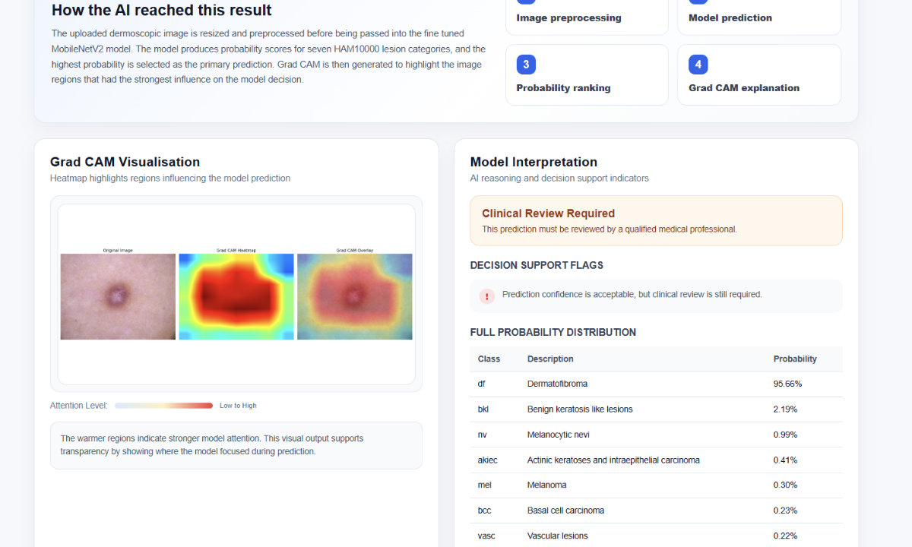

 

### What this project demonstrates

• Independent research based AI prototype development  
• Transfer learning with MobileNetV2  
• Flask based deployment of a machine learning model  
• Explainability through Grad CAM and SHAP exploration  
• Responsible communication for health related AI systems  
• Careful framing of AI outputs with human oversight  
• Ability to connect technical implementation with ethical and human centred design  

---

## Featured Project Gallery

<table>
<tr>
<td width="50%">
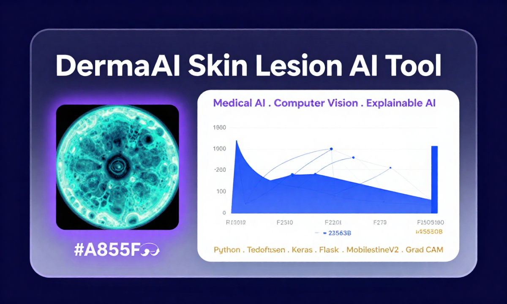
<h3>DermaAI Skin Lesion AI Tool</h3>

Independent final year research project focused on explainable AI for skin lesion decision support.

<b>Python · TensorFlow · Keras · Flask · MobileNetV2 · Grad CAM · SHAP</b>

</td>

<td width="50%">
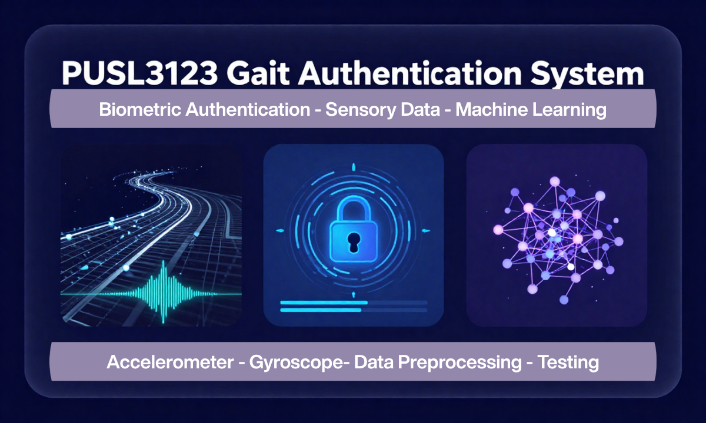
<h3>PUSL3123 Gait Authentication System</h3>

AI and ML project using accelerometer and gyroscope based gait data for biometric authentication.

<b>Machine Learning · Sensor Data · Data Preprocessing · Testing</b>

</td>
</tr>

<tr>
<td width="50%">
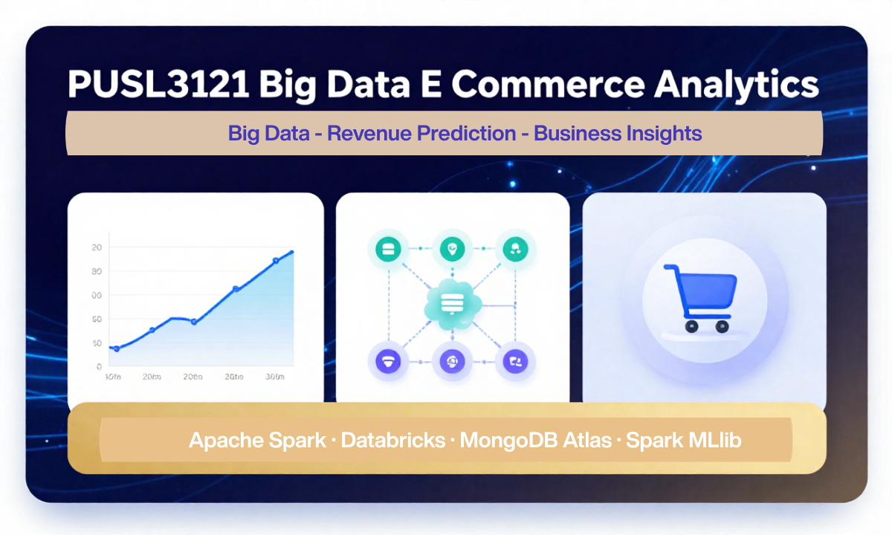
<h3>PUSL3121 Big Data E Commerce Analytics</h3>

Big data analytics project using Apache Spark, Databricks, MongoDB Atlas, Spark MLlib, and revenue prediction.

<b>Apache Spark · Databricks · MongoDB Atlas · Spark MLlib</b>

</td>

<td width="50%">
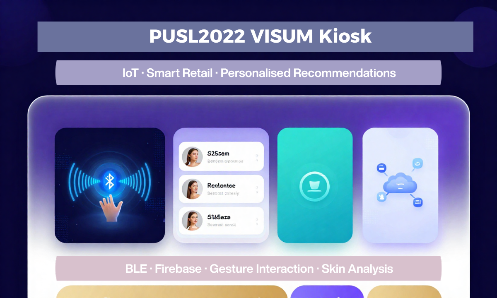
<h3>PUSL2022 VISUM Kiosk</h3>

IoT based personalised shopping kiosk with BLE user recognition, skin analysis, gesture interaction, and recommendations.

<b>IoT · BLE · Firebase · Gesture Interaction · Recommendations</b>

</td>
</tr>
</table>

---

## Full Project Portfolio

| Priority | Project | Main Area | My Contribution |
| :---: | :--- | :--- | :--- |
| 1 | **DermaAI Skin Lesion AI Tool** | Medical AI, XAI, Computer Vision | Independent development, model integration, Flask app, explainability, responsible AI framing |
| 2 | **PUSL3123 Gait Authentication System** | AI, ML, Biometrics | Background research, testing methodology, data preprocessing |
| 3 | **PUSL3121 Big Data E Commerce Analytics** | Big Data, Prediction | Analytics workflow, data processing, revenue prediction direction |
| 4 | **PUSL2022 VISUM Kiosk** | IoT, Smart Retail | Testing, hardware assembly, BLE, recommendations, connected kiosk logic |
| 5 | **PUSL3120 Pizzeria Ordering System** | Full Stack, Database | Database design, MongoDB Atlas structure, report design |
| 6 | **PUSL3122 Furnish Planner** | HCI, Web, Visualisation | Backend development, design CRUD, furniture item CRUD, documentation |
| 7 | **PUSL2021 NSBM Super App** | Mobile App, Campus Systems | Scheduling, attendance, diagrams, Figma, feasibility, documentation |
| 8 | **PUSL2023 Recipe Recommendation App** | Flutter, Firebase | Recipe page, save recipe function, auth logic, navigation, Chapter 2 |
| 9 | **PUSL2020 AQI Monitoring System** | Testing, QA | Unit, integration, functional test cases, testing report, validation |
| 10 | **PUSL2019 Supermarket POS Database System** | Database Systems | Tables, constraints, sample data, SQL validation, relational integrity |
| 11 | **PUSL2018 Monte Carlo Simulation** | Python Simulation | Plotting logic, output visualisation, results testing, documentation |
| 12 | **NSBM Speakers’ Club Membership Automation System** | Automation, Leadership | Google Apps Script system, email automation, validation, logging, member communication |

---

## Skills and Tools

### Programming and Development

  

### AI, Data and Cloud Tools

 

<table>
<tr>
<td width="50%">

### Artificial Intelligence and Machine Learning

• Machine learning  
• Computer vision  
• Transfer learning  
• Model evaluation  
• Explainable AI  
• Grad CAM  
• SHAP exploration  
• Responsible AI communication  
• Health technology applications  

</td>
<td width="50%">

### Data Science and Big Data

• Data analysis  
• Data preprocessing  
• Data visualisation  
• Revenue prediction  
• Linear Regression  
• Apache Spark  
• Databricks  
• Spark MLlib  
• MongoDB Atlas  

</td>
</tr>

<tr>
<td width="50%">

### Software Development

• Python  
• Java  
• C Sharp  
• PHP  
• JavaScript  
• TypeScript  
• React.js  
• Flutter  
• Flask  
• ASP.NET  

</td>
<td width="50%">

### Automation and Systems

• Google Apps Script  
• Google Sheets automation  
• GmailApp  
• HTML email templates  
• Validation checks  
• Logging  
• Workflow design  
• Process automation  
• Membership communication workflows  

</td>
</tr>
</table>

---

## GitHub Activity

  

---

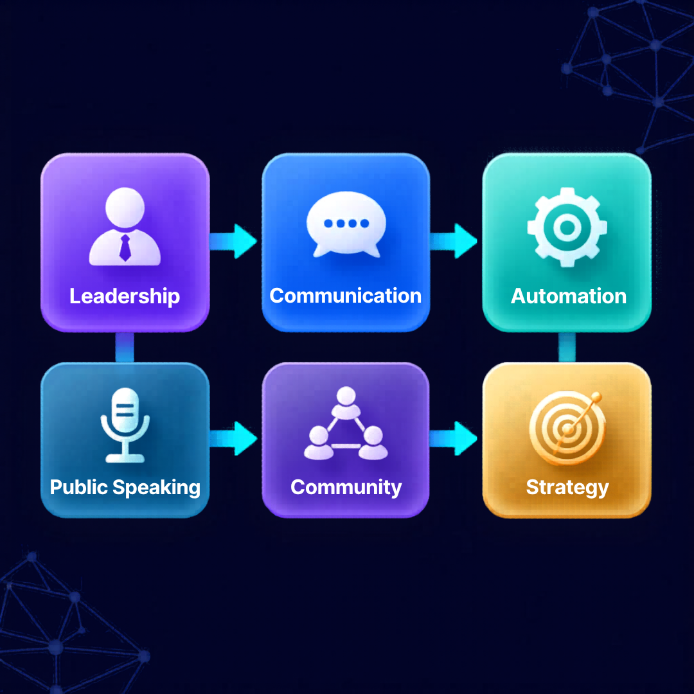

## Leadership and Beyond Code

Beyond technical development, I have actively worked across leadership, communication, student organisations, public speaking, event coordination, membership operations, and structured communication workflows.

My experience includes work with **AIESEC**, the **NSBM Speakers’ Club**, the **English Literary Association**, student association projects, public speaking spaces, automation systems, and team based leadership environments.

These experiences have shaped how I approach technology. I value systems that are not only functional, but also clear, organised, user aware, and easy for people to understand.

For me, strong work is not only about building the product. It is also about explaining it well, documenting it clearly, leading people through it, and making sure it serves a real purpose.

 

---

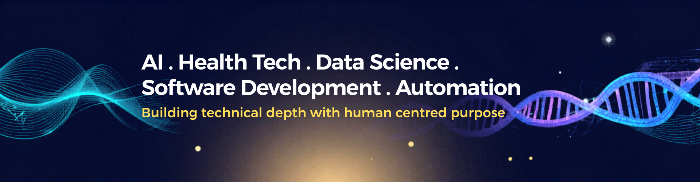

## What I Am Building Towards

I am building a professional direction around **AI, health technology, data science, responsible digital systems, software development, and workflow automation**.

My long term goal is to grow into a visible, high impact technology professional with strong technical ability, creative judgement, leadership experience, and a clear public presence.

---

## Connect With Me

 

